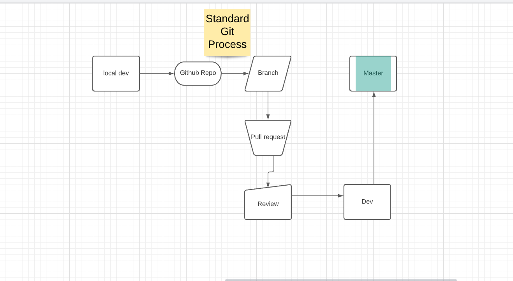

# Covid19 Self Checker
#Advance Programming

image::covid19.png[alt=logo,width=250px][orientation=portrait]

:Covid-Checker_Website: Covid Self checker
:Covid-Checker_ENV: Staging
:Covid-Checker_URL: http://sabdul.it.pointpark.edu:3000/
:Covid-Checker_STATUS: OFFLINE
:Covid-Checker_VERSION: 1.001

# What is the Covid-19 Self checker?
this website is a covid self checker using user submitted data to make analysis

# What OS does Covid-19 Self checker on?
It's an native HTML website that can be accessed through any mobile browser or regular web browser.

# What Enviorment was the App was the App Developed in?
 Github
 Visual Studio
 notepad
MySql 

# What Programming Languages were used?
HTML
CSS
JavaScript
Jquery
Mysql
Ajax

## Application Environment Details

[grid="rows",format="csv"]
[options="header", cols="^,<,<s,<,>m"]
|==========================
App,Location,Environment,URL,Status,Version
`{Covid-Checker_Website}`,`{Covid-Checker_ENV}`,`{Covid-Checker_URL}`,`{Covid-Checker_STATUS}`,`{Covid-Checker_VERSION}`
|==========================

##GitHub Process Strategy 

[orientation=portrait]
